Easy clusters
################################################

Let's start with finding clusters using a very easy dataset.

Generate data
**************

Install requried libraries

.. code:: bash

	pip install scatterd
	pip install sklearn

.. code:: python

	# Imports
	from sklearn.datasets import make_blobs
	
	# Generate random data
	X, _ = make_blobs(n_samples=750, centers=4, n_features=2, cluster_std=0.5)
	
	# Scatter samples
	scatterd(X[:,0], X[:,1],label=y, figsize=(6,6));

.. |figCX7| image:: ../figs/easy_clusters_no_labels.png
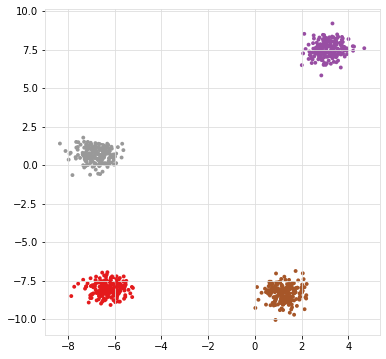

.. table:: Left: Samples without labels. Right: Samples colored on labels.
   :align: center

   +----------+----------+
   | |figCX7| | |figCX8| |
   +----------+----------+

Cluster Evaluation
*********************

# Determine the optimal number of clusters

.. code:: python

	# Import
	from clusteval import clusteval

	# Initialize
	ce = clusteval(evaluate='silhouette')

	# Fit
	ce.fit(X)

	# Plot
	ce.plot()
	ce.dendrogram()
	ce.scatter(X)

.. |figCX9| image:: ../figs/easy_clusters_nr_clusters.png
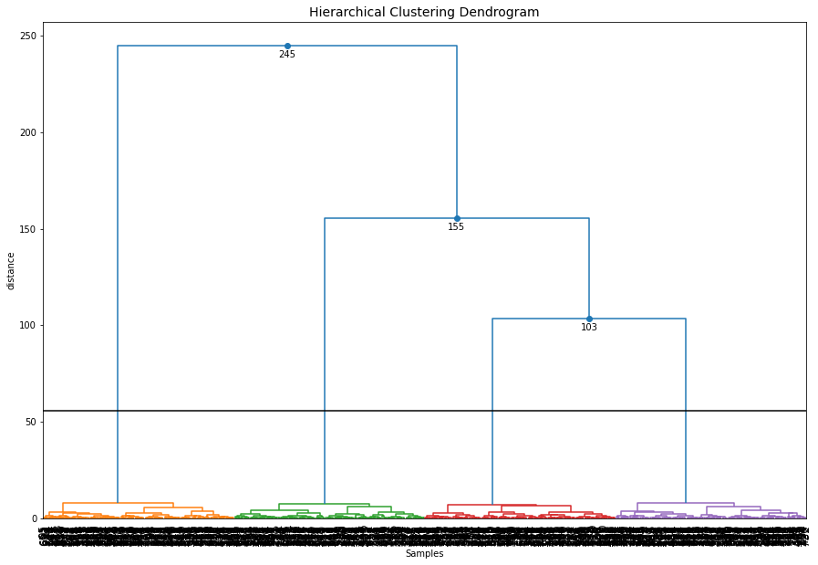
.. |figCX11| image:: ../figs/easy_clusters_silhouette.png

.. table:: 
   :align: center

   +----------+----------+
   | |figCX9| | |figCX10||
   +----------+----------+
   |       |figCX11|     |
   +----------+----------+

Cluster Comparison
*********************

.. code:: python

	import clusteval

	plt.figure()
	fig, axs = plt.subplots(2,4, figsize=(25,10))

	# dbindex
	results = clusteval.dbindex.fit(X)
	_ = clusteval.dbindex.plot(results, title='dbindex', ax=axs[0][0], visible=False)
	axs[1][0].scatter(X[:,0], X[:,1],c=results['labx']);axs[1][0].grid(True)

	# silhouette
	results = clusteval.silhouette.fit(X)
	_ = clusteval.silhouette.plot(results, title='silhouette', ax=axs[0][1], visible=False)
	axs[1][1].scatter(X[:,0], X[:,1],c=results['labx']);axs[1][1].grid(True)

	# derivative
	results = clusteval.derivative.fit(X)
	_ = clusteval.derivative.plot(results, title='derivative', ax=axs[0][2], visible=False)
	axs[1][2].scatter(X[:,0], X[:,1],c=results['labx']);axs[1][2].grid(True)

	# dbscan
	results = clusteval.dbscan.fit(X)
	_ = clusteval.dbscan.plot(results, title='dbscan', ax=axs[0][3], visible=False)
	axs[1][3].scatter(X[:,0], X[:,1],c=results['labx']);axs[1][3].grid(True)

	plt.show()

.. |figCX12| image:: ../figs/easy_clusters_comparisons.png

.. table:: 
   :align: center

   +----------+----------+
   |       |figCX12|     |
   +----------+----------+

Snake clusters
################################################################

The definition of a **cluster** depends on, among others, the **aim**. In this experiment I will evaluate the goodness of clusters when the aim is to find circular or snake clusters.

.. code:: bash

	pip install scatterd
	pip install sklearn

.. code:: python
	
	# Import some required libraries for this experiment
	from sklearn.datasets import make_circles
	from scatterd import scatterd

	# Generate data
	X,y = make_circles(n_samples=2000, factor=0.3, noise=0.05, random_state=4)
	scatterd(X[:,0], X[:,1],label=y, figsize=(6,6));

.. |figCX1| image:: ../figs/circular_cluster_labels.png
.. |figCX2| image:: ../figs/circular_cluster_black.png

.. table:: Left: Samples without labels. Right: Samples colored on labels.
   :align: center

   +----------+----------+
   | |figCX1| | |figCX2| |
   +----------+----------+

Ward distance
***************

If we aim to determine snake clusters, it is best to use the ``single`` linkage type as it hierarchically connects samples with the closest group. For demonstration purposes, I will show what happens when a metric such as ``ward`` distance is used. Note that this metric uses the centroids to group samples. 

.. code:: python
	
	# Load library
	from clusteval import clusteval

	# Initialize
	ce = clusteval(cluster='agglomerative', linkage='ward', evaluate='silhouette')

	# Fit
	results = ce.fit(X)
	
	# Plot
	ce.plot()
	ce.scatter(X)

.. |figCX3| image:: ../figs/circular_cluster_nr_clusters.png
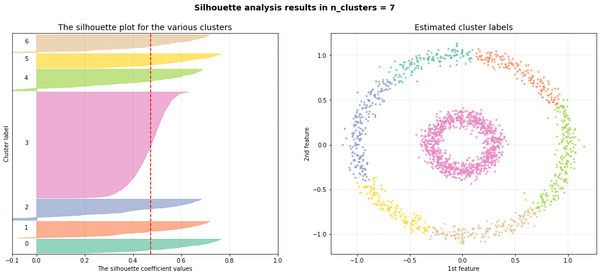

.. table:: 
   :align: center

   +----------+----------+
   | |figCX3| | |figCX4| |
   +----------+----------+

As can be seen, the inner circle is detected as one cluster but the outside circle is devided into multiple smaller clusters.

Single distance
*****************

If the aim is to cluster samples that are in a **snake pattern**, it is best to use the ``single`` linkage type as it hierarchically connects samples to the closest group. 

.. code:: python
	
	from clusteval import clusteval

	# Initialize
	ce = clusteval(cluster='agglomerative', linkage='single', evaluate='silhouette')

	# Fit
	results = ce.fit(X)
	
	# Plot
	ce.plot()
	ce.scatter(X)

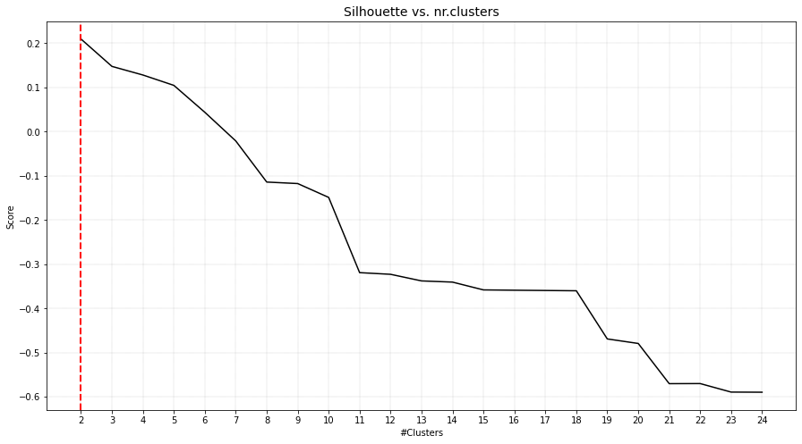
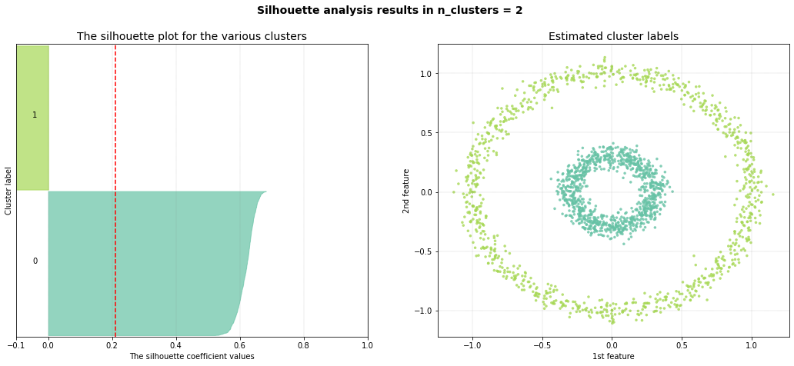

.. table:: 
   :align: center

   +----------+----------+
   | |figCX5| | |figCX6| |
   +----------+----------+

As can be seen, the inner circle is detected as one cluster but the outside circle is devided into multiple smaller clusters.

Different Density Clusters
################################################

Many cluster evaluation methods can easily determine the optimal number of clusters when clusters are evenly distributed for which the groups of samples have similar density. Here I will generate groups of samples with various densities to demontrate the performance of the cluster evaluation methods.

Generate Dataset
***************************************

Let's generate 5 groups of samples, each with 200 but with different standard deviations per cluster. 

.. code:: python
	
	# Import libraries
	from sklearn.datasets import make_blobs
	import matplotlib.pyplot as plt
	import numpy as np
	
	# Create random blobs
	X, y = make_blobs(n_samples=200, n_features=2, centers=2, random_state=1)

	# Make more blobs with different densities
	c = np.random.multivariate_normal([40, 40], [[20, 1], [1, 30]], size=[200,])
	d = np.random.multivariate_normal([80, 80], [[30, 1], [1, 30]], size=[200,])
	e = np.random.multivariate_normal([0, 100], [[200, 1], [1, 100]], size=[200,])

	# Concatenate the data
	X = np.concatenate((X, c, d, e),)
	y = np.concatenate((y, len(c)*[2], len(c)*[3], len(c)*[4]),)
	
	plt.figure(figsize=(15,10))
	plt.scatter(X[:,0], X[:,1])
	plt.grid(True); plt.xlabel('Feature 1'); plt.ylabel('Feature 2')

.. |figC1| image:: ../figs/random_clusters_density_black.png
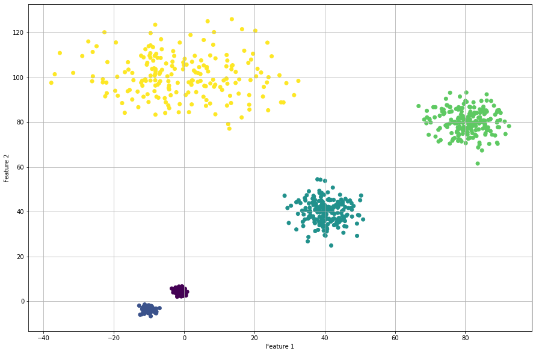

.. table:: Left plot: group of samples with different densities. Right plot: True labels
   :align: center

   +----------+-----------+
   | |figC1|  |  |figC2|  |
   +----------+-----------+

Derivative Method
********************

The optimal number of clusters is 4 but the original dataet consits out of 5 clusters.
When we scatter plot the samples with the etimated cluster labels, it can be seen that this approach has trouble in finding the correct labels for the smaller high density groups. Note that the results did not change in case of using the different clustering methods, such as 'agglomerative', and 'kmeans'.

.. code:: python

	# Intialize model
	ce = clusteval(cluster='agglomerative', evaluate='derivative')

	# Cluster evaluation
	results = ce.fit(X)
	
	# The clustering label can be found in:
	print(results['labx'])

	# Make plots
	ce.plot()
	ce.scatter(X)

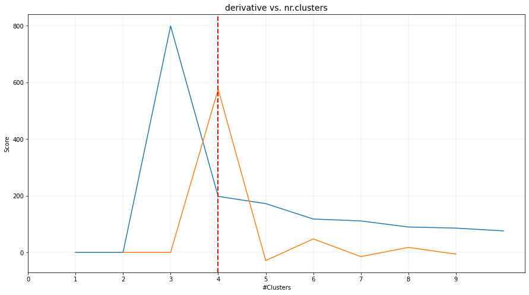
.. |figC5| image:: ../figs/Derivative_random_samples_scatter.png

.. table:: 
   :align: center

   +----------+----------+
   | |figC4|  | |figC5|  |
   +----------+----------+

Silhouette Method
*********************

The silhouette method detects an optimum of 4 clusters. The scatterplot shows that it has troubles in finding the high density clusters. Note that when using ``cluster='agglomerative'``, similar results are detected.

.. code:: python

	# Intialize model
	ce = clusteval(cluster='agglomerative', evaluate='silhouette')

	# Cluster evaluation
	results = ce.fit(X)
	
	# The clustering label can be found in:
	print(results['labx'])

	# Make plots
	ce.plot()
	ce.scatter(X)

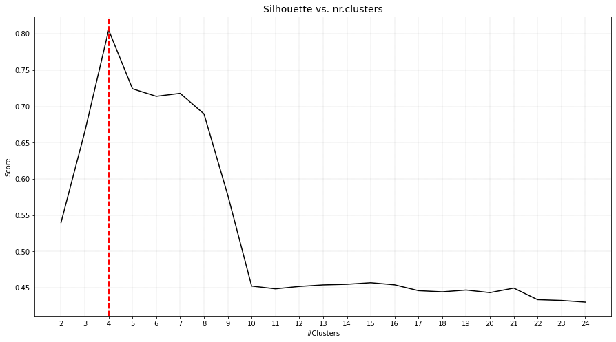
.. |figC7| image:: ../figs/random_agglomerative_silhouette_2.png

.. table:: 
   :align: center

   +----------+----------+
   | |figC6|  | |figC7|  |
   +----------+----------+

DBindex method
*********************

The DBindex method finds 4 cluster scores lowers gradually and stops at 22 clusters. This is (almost) the maximum default search space. The search space can be altered using ``min_clust`` and ``max_clust`` in the function function :func:`clusteval.clusteval.clusteval.fit. It is recommended to set ``max_clust=10`` for find the local optimal minima.

.. code:: python

	# Intialize model
	ce = clusteval(cluster='agglomerative', evaluate='dbindex')

	# Cluster evaluation
	results = ce.fit(X)

	# The clustering label can be found in:
	print(results['labx'])

	# Make plots
	ce.plot()
	ce.scatter(X)
	ce.dendrogram()

.. |figC8| image:: ../figs/random_agglomerative_dbindex_1.png
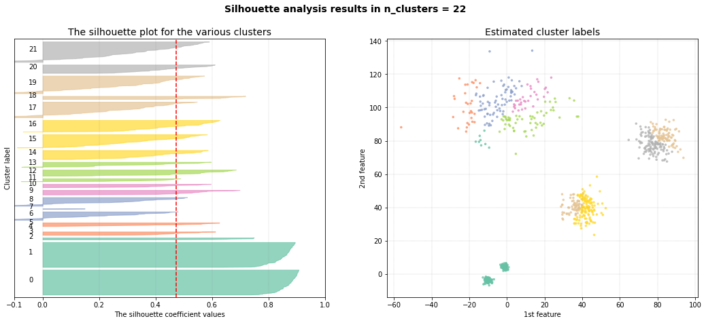
.. |figC10| image:: ../figs/random_agglomerative_dbindex_3.png

.. table:: 
   :align: center

   +----------+----------+
   | |figC8|  | |figC10| |
   +----------+----------+
   |       |figC9|       |
   +----------+----------+

Set the ``max_clust=10`` for find the local optimal minima.

.. code:: python

	# Intialize model
	ce = clusteval(cluster='agglomerative', evaluate='dbindex', max_clust=10)

	# Cluster evaluation
	results = ce.fit(X)

	# Make plots
	ce.plot()
	ce.scatter(X)
	ce.dendrogram()

.. |figC11| image:: ../figs/random_agglomerative_dbindex_4.png
.. |figC12| image:: ../figs/random_agglomerative_dbindex_5.png
.. |figC13| image:: ../figs/random_agglomerative_dbindex_6.png

.. table:: 
   :align: center

   +----------+----------+
   | |figC11| | |figC12| |
   +----------+----------+
   |       |figC13|      |
   +----------+----------+

DBSCAN
***********

The ``eps`` parameter is gridsearched together with a varying number of clusters. The global maximum is found at the expected 5 clusters. When we scatter the samples with the new cluster labels, it can be seen that this approach works pretty well. However, for the cluster with large deviation, many **outliers** are marked with the default parameters. 

.. code:: python

	# Intialize model
	ce = clusteval(cluster='dbscan')

	# Parameters can be changed for dbscan:
	# ce = clusteval(cluster='dbscan', params_dbscan={'epsres' :100, 'norm':True})

	# Cluster evaluation
	results = ce.fit(X)

	# [clusteval] >Fit using dbscan with metric: euclidean, and linkage: ward
	# [clusteval] >Gridsearch across epsilon..
	# [clusteval] >Evaluate using silhouette..
	# 100%|██████████| 245/245 [00:11<00:00, 21.73it/s][clusteval] >Compute dendrogram threshold.
	# [clusteval] >Optimal number clusters detected: [7].
	# [clusteval] >Fin.

	# The clustering label can be found in:
	print(results['labx'])

	# Make plots
	ce.plot()
	ce.scatter(X)

.. |figCE7| image:: ../figs/random_dbscan_1.png
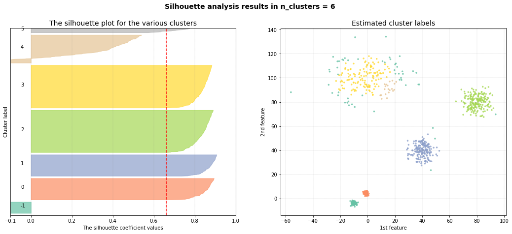

.. table:: Left: the DBindex cluster evaluation. Right: The tSNE plot coloured based on the cluster-labels.
   :align: center

   +----------+----------+
   | |figCE7| | |figCE8| |
   +----------+----------+

HDBSCAN
***********

Install the library first because this approach is not installed by default in ``clusteval``. 

.. code:: bash

	pip install hdbscan

.. code:: python

	# Intialize model
	ce = clusteval(cluster='hdbscan')

	# Cluster evaluation
	results = ce.fit(X)

	# Make plots
	ce.plot()
	ce.scatter(X)

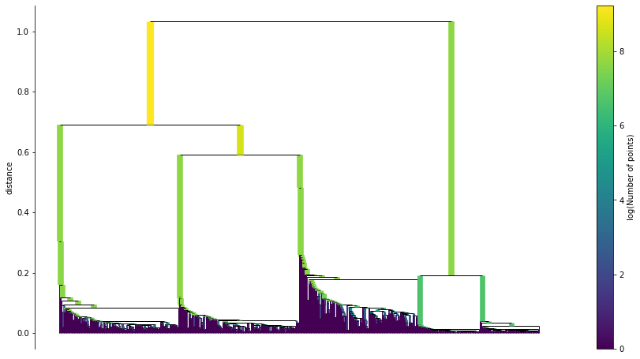
.. |figCE10| image:: ../figs/circular_cluster_hdbscan2.png
.. |figCE11| image:: ../figs/circular_cluster_hdbscan3.png

.. table:: Left: the DBindex cluster evaluation. Right: The tSNE plot coloured based on the cluster-labels.
   :align: center

   +----------+----------+
   | |figCE9| | |figCE10||
   +----------+----------+
   |      |figCE11|      |
   +----------+----------+

Comparison methods
**********************

A comparison of all four methods when using **kemans** is as shown underneath. The best approach is ``dbscan`` in case of having various density groups.

.. code:: python
	
	import matplotlib.pyplot as plt
	import clusteval

	plt.figure()
	fig, axs = plt.subplots(2,4, figsize=(25,10))

	# dbindex
	results = clusteval.dbindex.fit(X)
	_ = clusteval.dbindex.plot(results, title='dbindex', ax=axs[0][0], visible=False)
	axs[1][0].scatter(X[:,0], X[:,1],c=results['labx']);axs[1][0].grid(True)

	# silhouette
	results = clusteval.silhouette.fit(X)
	_ = clusteval.silhouette.plot(results, title='silhouette', ax=axs[0][1], visible=False)
	axs[1][1].scatter(X[:,0], X[:,1],c=results['labx']);axs[1][1].grid(True)

	# derivative
	results = clusteval.derivative.fit(X)
	_ = clusteval.derivative.plot(results, title='derivative', ax=axs[0][2], visible=False)
	axs[1][2].scatter(X[:,0], X[:,1],c=results['labx']);axs[1][2].grid(True)

	# dbscan
	results = clusteval.dbscan.fit(X)
	_ = clusteval.dbscan.plot(results, title='dbscan', ax=axs[0][3], visible=False)
	axs[1][3].scatter(X[:,0], X[:,1],c=results['labx']);axs[1][3].grid(True)

	plt.show()

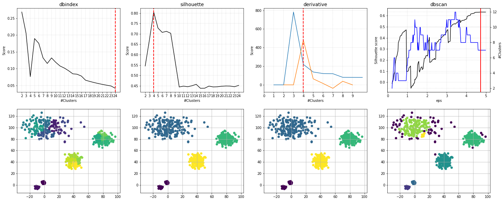

.. table:: Comparison of all methods.
   :align: center

   +----------+
   | |figCE9| |
   +----------+

.. raw:: html

	

	

		
	

	

