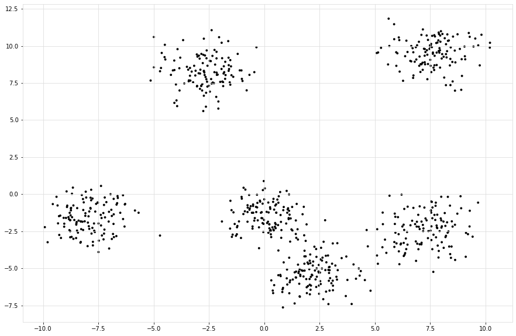
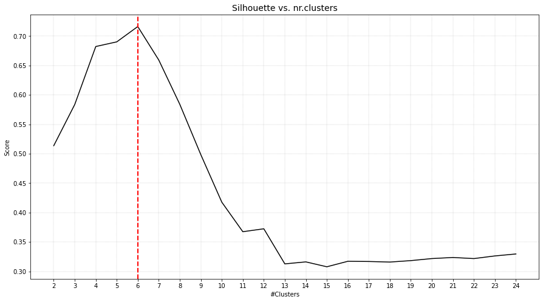
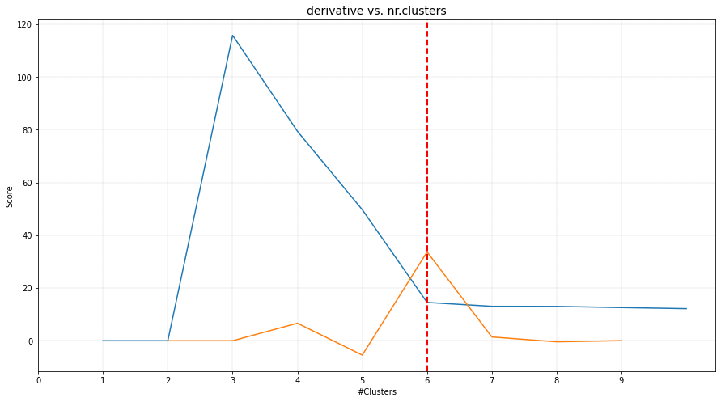
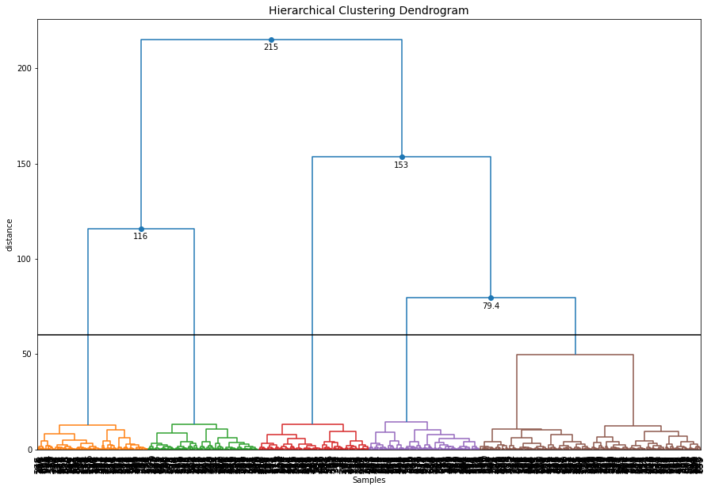

.. include:: add_top.add

Generate data
####################

Install requried libraries

.. code:: bash

	pip install scatterd
	pip install sklearn

Generate Data.

.. code:: python

	# Imports
	from sklearn.datasets import make_blobs
	
	# Generate random data
	X, _ = make_blobs(n_samples=750, centers=6, n_features=2, cluster_std=1)
	
	# Scatter samples
	scatterd(X[:,0], X[:,1], figsize=(15, 10));

.. table:: Six circular clusters
   :align: center

   +----------+
   | |figP1|  |
   +----------+

Plot
######################################

The plot functionality is to plot score of the cluster evaluation method versus the number of clusters.
For demonstration, the clusters are evaluated using four cluster evaluation methods. It can be seen that all methods were able to detect the expected six clusters.

.. code:: python

	# Import
	from clusteval import clusteval

	# Silhouette cluster evaluation.
	ce = clusteval(evaluate='silhouette')

	# In case of using dbindex, it is best to clip the maximum number of clusters to avoid finding local minima.
	ce = clusteval(evaluate='dbindex', max_clust=10)

	# Derivative method.
	ce = clusteval(evaluate='derivative')

	# DBscan method.
	ce = clusteval(cluster='dbscan')

	# Fit
	ce.fit(X)

	# Plot
	ce.plot()

.. |figP3| image:: ../figs/medium_clusters_dbindex.png

.. |figP5| image:: ../figs/medium_clusters_dbscan.png

.. table:: Method vs. number of clusters
   :align: center

   +----------+----------+
   | |figP2|  | |figP3|  |
   +----------+----------+
   | |figP4|  | |figP5|  |
   +----------+----------+

Scatterplot
################################################

The aim of the scatterplot is to scatter the samples with the **silhouette** coefficient values. Note that for the scatterplot, only the first two features can be used. 

.. code:: python

	# Plot
	ce.scatter(X)

.. |figP6| image:: ../figs/medium_clusters_sil_scatter.png

.. table:: Method vs. number of clusters for the silhouette method.
   :align: center

   +----------+
   | |figP6|  |
   +----------+

Dendrogram
#################

Hierarchical tree plot
***************************

To furter investigate the clustering results, a dendrogram can be created.

.. code:: python

	ce.dendrogram()

.. |figP10| image:: ../figs/medium_clusters_sil_dendrogram.png

.. table:: 
   :align: center

   +----------+
   | |figP10| |
   +----------+

Change the cut-off threshold
*****************************

The dendrogram function can now also be used to create differents cuts in the hierarchical clustering and retrieve the associated cluster labels. Let's cut the tree at level 60

.. code:: python
	
	# Plot the dendrogram and make the cut at distance height 60
	y = ce.dendrogram(max_d=60)

	# Cluster labels for this particular cut
	print(y['labx'])

.. table:: 
   :align: center

   +----------+
   | |figP11| |
   +----------+

Orientation
***********************

Change various parameters, such as orientation, leaf rotation, and the font size.

.. code:: python
	
	# Plot the dendrogram
	ce.dendrogram(orientation='left', leaf_rotation=180, leaf_font_size=8, figsize=(25,30))

.. |figP12| image:: ../figs/medium_clusters_sil_dendrogram_orientation.png

.. table:: 
   :align: center

   +----------+
   | |figP12| |
   +----------+

.. include:: add_bottom.add